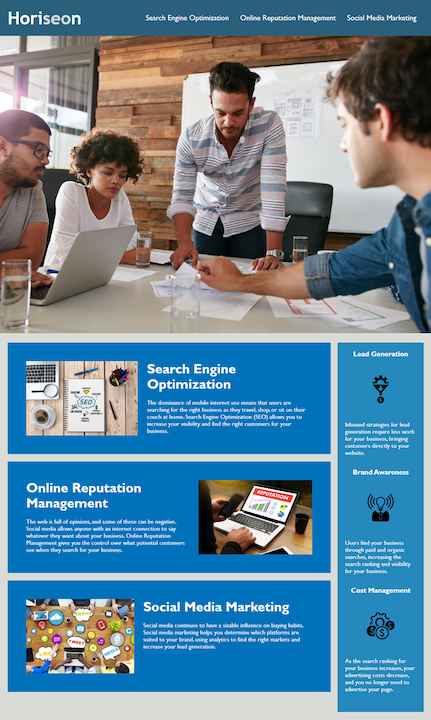

# ***Horiseon***

## About Us

We are a public relations firm that specialzes in companies online image.  
We help companies with Search Engine Optimization (SEO) to 
allow them to increase their visibility online and find the right customers for their business.   
We also help companies with Online Reputation Management,
which gives them the control over what potential customers see when they search for their business.
Lastly, social media marketing helps businesses determine which platforms are suited to their brand, 
using analytics to find the right markets and increase companies lead generation.

## What we want for our website

Horiseon wants a 1 page website that explains what we do in greater detail (**Refer to About Us on readme**). We want a website using images and templates that will be included in the same file as this README.

## Online Space
Please have our website hosted here: <https://atlas-ware.github.io/Challenge01/>

## Website Appearance

Please have the website resemble something like this (this image was created by our graphic designers):

